# XplagiaX MarkTrack
> **The Enterprise Ecosystem for Collaborative Academic Integrity** | **El Ecosistema Empresarial para la Integridad Académica Colaborativa**

[](https://www.python.org/)
[](https://flask.palletsprojects.com/)
[](LICENSE)
[](#)
[](#)

---

## 🌍 1. Executive Summary / Resumen Ejecutivo

**[EN]** XplagiaX MarkTrack is a PhD-grade collaborative document platform engineered for the intersection of high-stakes academia and enterprise-level security. It provides a real-time, conflict-free editing environment (powered by CRDTs) paired with a robust "Dark Glass" UI. Designed for extreme scalability, it leverages an asynchronous Eventlet-based architecture to handle thousands of concurrent state updates with sub-millisecond latency.

**[ES]** XplagiaX MarkTrack es una plataforma de documentos colaborativos de nivel PhD diseñada para la intersección de la academia de alto nivel y la seguridad de nivel empresarial. Proporciona un entorno de edición en tiempo real sin conflictos (basado en CRDT) junto con una robusta interfaz "Dark Glass". Diseñada para una escalabilidad extrema, aprovecha una arquitectura asíncrona basada en Eventlet para manejar miles de actualizaciones de estado concurrentes con latencia de submilisegundos.

---

## 🏗️ 2. Architectural Philosophy / Filosofía Arquitectónica

### 2.1 Technical Topology / Topología Técnica
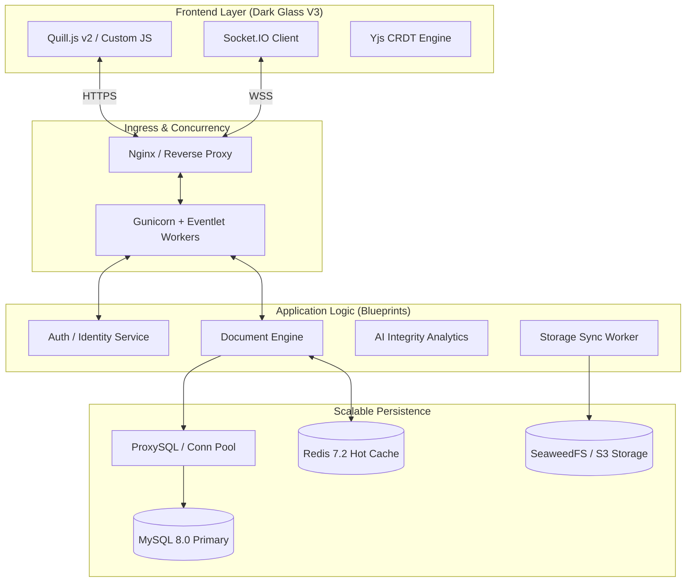

---

## 🔄 3. Detailed Service Lifecycles / Ciclos de Vida de Servicios

### 3.1 Global Security Middleware Flow
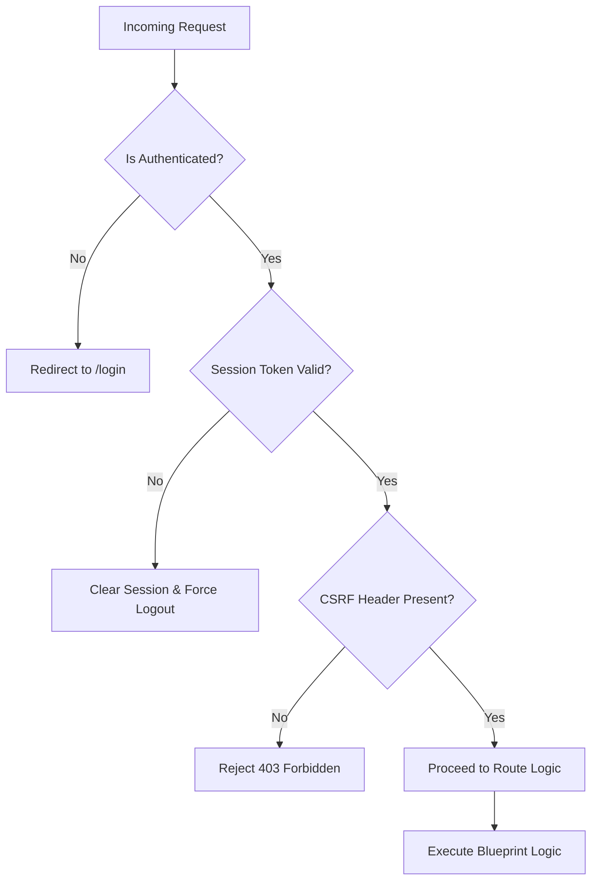

### 3.2 Authentication Lifecycle (OAuth2/OIDC)
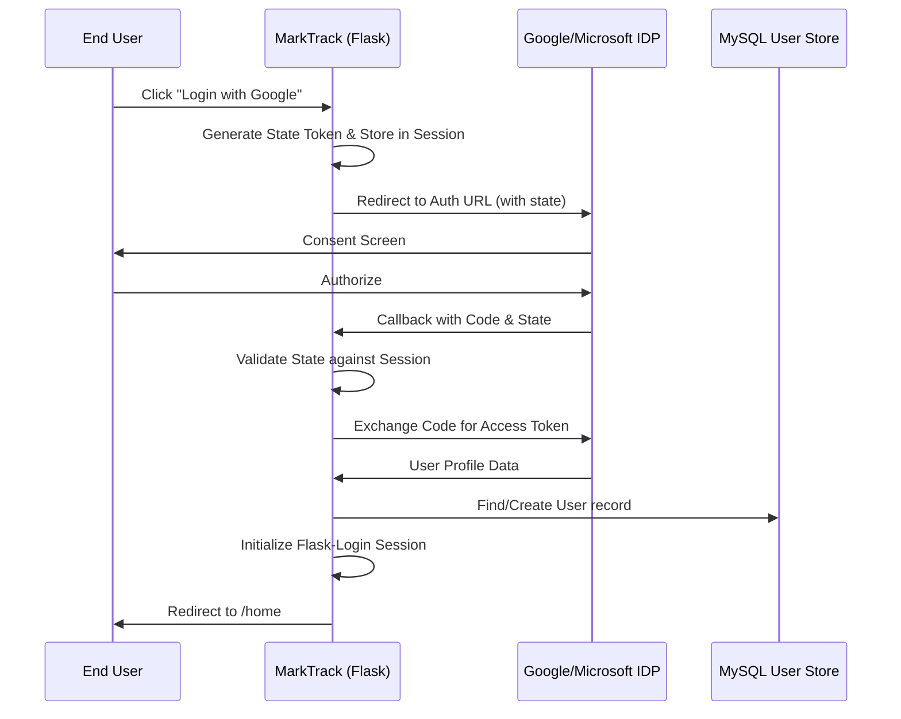

### 3.3 Real-Time Notification Dispatch Engine
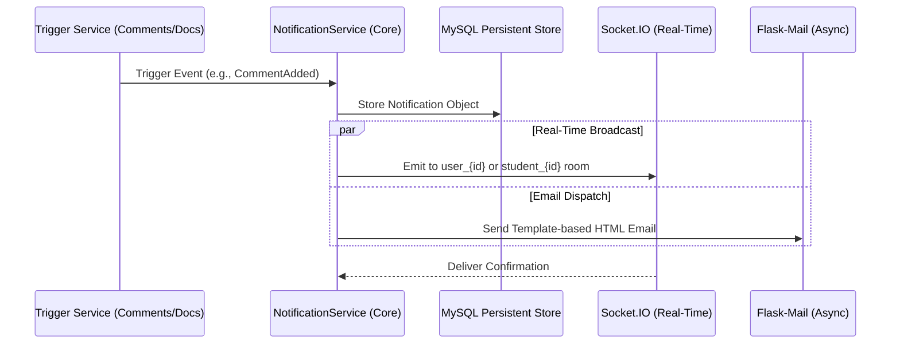

### 3.4 Document Export & Hybrid Storage Flow
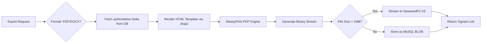

### 3.5 Real-Time CRDT Pipeline (Redis-to-MySQL)
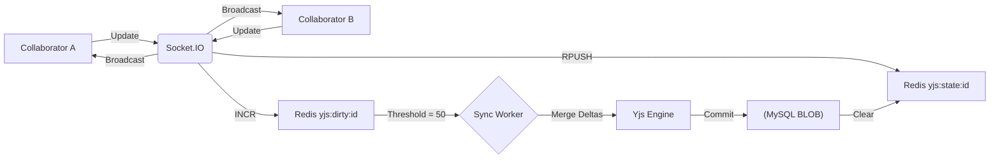

### 3.6 Forensic Metrics Ingestion Pipeline
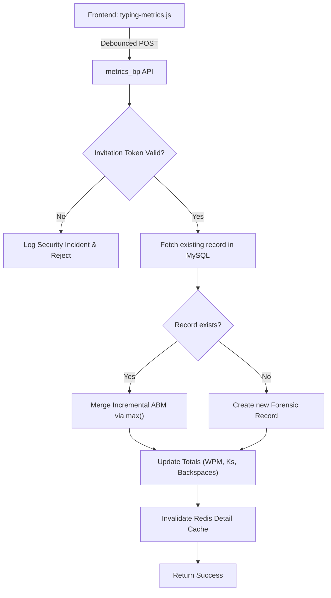

### 3.7 Extension Request Workflow (Prórroga)
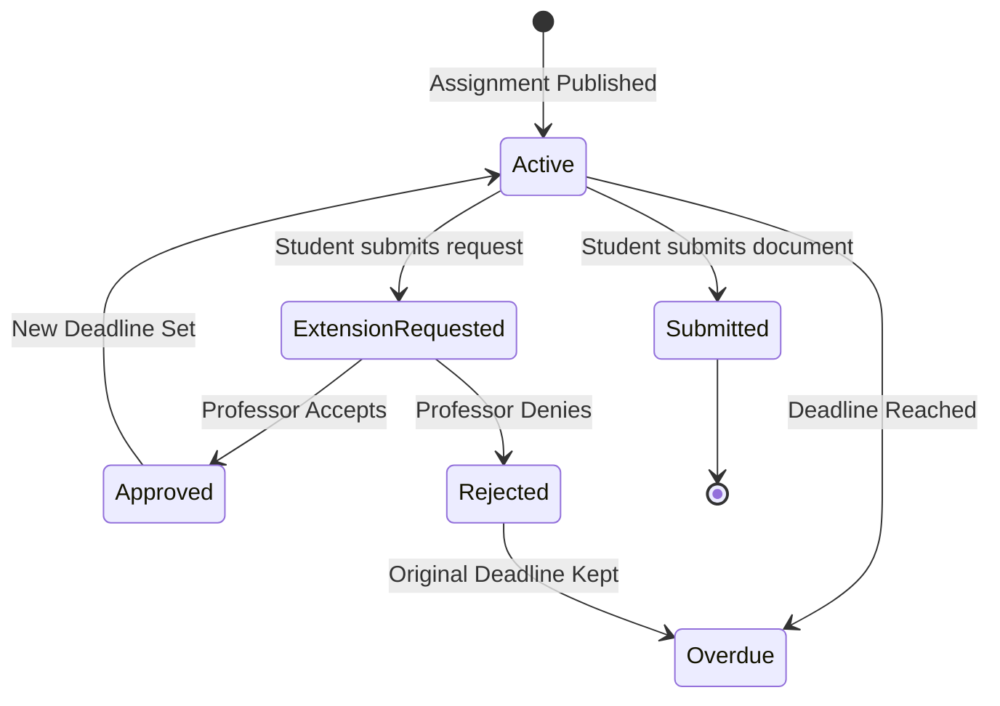

### 3.8 Workspace Invitation & Admission Flow
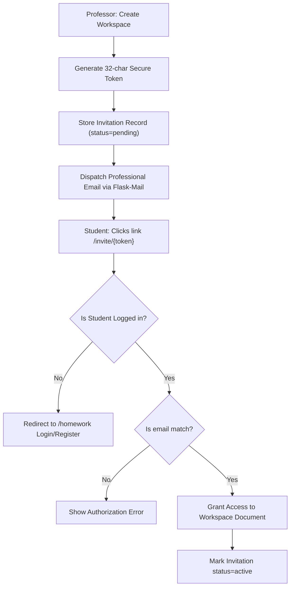

### 3.9 Recursive Folder Deletion Logic
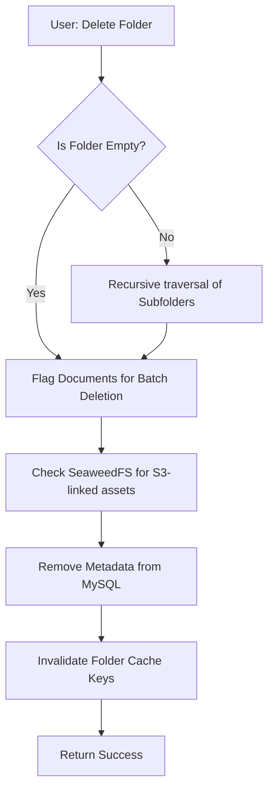

### 3.10 Socket.IO Awareness (Cursor Tracking)
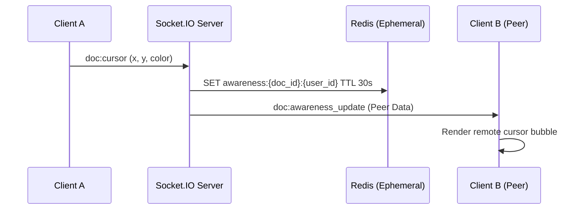

---

## 🛡️ 4. Security & Forensic Architecture / Seguridad y Arquitectura Forense

### 4.1 Academic Integrity Telemetry
**[EN]** MarkTrack analyzes the "Cognitive Rhythm" of writing using high-fidelity metrics:
*   **WPM Analysis**: Detects content bursts indicative of unauthorized copy-pasting.
*   **Keystroke Dynamics**: Tracks `avg_hold_ms` and `avg_interkey_ms` to verify authorship.
*   **Incremental Ingestion**: Uses `max()` merging for activity-by-minute data from fragmented sessions.

---

## ⚙️ 5. Settings & Configuration Matrix / Matriz de Configuración

### 5.1 Redis Partitioning Strategy
| DB Index | Component | Responsibility |
| :--- | :--- | :--- |
| `0` | **Flask-Caching** | Hot cache for metadata and templates. |
| `1` | **App Logic** | Rate limiting, distributed locks, and session tokens. |
| `2` | **SocketIO** | Async message queue for Eventlet workers. |
| `3` | **Dogpile** | Result-set caching for ORM layer. |

---

## 🛠️ 6. Maintenance & Production Ops / Mantenimiento y Operaciones

### 6.1 Gunicorn + Eventlet Formulas
**[EN]** Recommended configuration for 1,000+ concurrent users:
```bash
gunicorn -k eventlet -w 9 --threads 2 --bind 0.0.0.0:5002 app:app
```

### 6.2 Docker Deployment Guide / Guía de Despliegue en Docker

#### 🐳 6.2.1 Building the Docker Image / Construcción de la Imagen
**[EN]** Build the runtime image from the root workspace directory:
```bash
docker build -t xplagiax/marktrack:latest .
```
**[ES]** Construye la imagen de producción desde el directorio raíz:
```bash
docker build -t xplagiax/marktrack:latest .
```

---

#### 🏃‍♂️ 6.2.2 Running the Container / Ejecución del Contenedor (docker run)
**[EN]** Launch the container in production using the `docker run` command:
```bash
docker run -d \
  --name marktrack_app \
  -p 5002:5002 \
  -e SECRET_KEY="your-production-secret-key" \
  -e SECURITY_PASSWORD_SALT="your-production-salt" \
  -e APP_BASE_URL="https://marktrack.xplagiax.ca" \
  -e GOOGLE_REDIRECT_URI="https://marktrack.xplagiax.ca/auth_bp/google/callbackx" \
  -e MICROSOFT_REDIRECT_URI="https://marktrack.xplagiax.ca/auth_bp/microsoft/callback" \
  xplagiax/marktrack:latest
```

**[ES]** Lanza el contenedor de producción utilizando el comando `docker run`:
```bash
docker run -d \
  --name marktrack_app \
  -p 5002:5002 \
  -e SECRET_KEY="tu-llave-secreta-de-produccion" \
  -e SECURITY_PASSWORD_SALT="tu-sal-de-produccion" \
  -e APP_BASE_URL="https://marktrack.xplagiax.ca" \
  -e GOOGLE_REDIRECT_URI="https://marktrack.xplagiax.ca/auth_bp/google/callbackx" \
  -e MICROSOFT_REDIRECT_URI="https://marktrack.xplagiax.ca/auth_bp/microsoft/callback" \
  xplagiax/marktrack:latest
```

##### 🔍 Parametric Breakdown / Desglose de Parámetros:
*   `-d` / `--detach`: Runs the container in the background (daemon mode). / *Ejecuta el contenedor en segundo plano.*
*   `--name`: Assigns a readable identity to the container instance. / *Asigna un identificador legible a la instancia.*
*   `-p 5002:5002`: Maps internal port `5002` to the host port `5002`. / *Mapea el puerto del servidor host al puerto del contenedor.*
*   `-e KEY="value"`: Declares environment variables. **Set these to your secure production values.** / *Declara variables de entorno del contenedor.*

---

#### 📄 6.2.3 Running with an Environment File / Despliegue Simplificado con .env
**[EN]** For automated environments, place your variables inside a `.env` file and execute:
```bash
docker run -d --name marktrack_app -p 5002:5002 --env-file .env xplagiax/marktrack:latest
```
**[ES]** Para mayor simplicidad y orden, guarda tus variables en un archivo `.env` y ejecuta:
```bash
docker run -d --name marktrack_app -p 5002:5002 --env-file .env xplagiax/marktrack:latest
```

---

## ⚖️ 7. License & Credits / Licencia y Créditos

© 2026 UryxSoft. MIT Licensed.
*Special thanks to the open-source communities behind Yjs, Quill, and Flask.*
