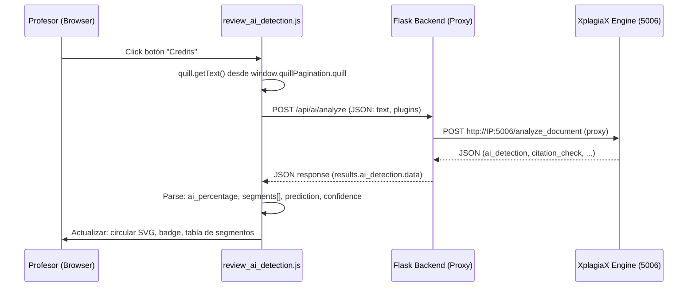

# Integración de Análisis Interactivo de IA en Review — AI Detection Tab

Integrar un botón de acción dentro del tab **AI DETECTION** de `review.html` que, al hacer click, capture el texto del editor Quill.js, lo envíe al servicio XplagiaX (`http://[IP_ADDRESS]/ai/analyze/`), procese la respuesta JSON, y actualice dinámicamente la UI existente (circular progress, badge, tabla de segmentos) **sin alterar el diseño/colores actuales**.

## Diagrama de Flujo



## Proposed Changes

### 1. Backend — Proxy Endpoint

#### [NEW] Route en [workspace_routes.py](file:///Users/user/Documents/xplagiax_marktrack/routes/workspace_routes.py)

Agregar un endpoint proxy `POST /api/ai/analyze` dentro de `workspace_routes.py` (o un nuevo archivo `ai_routes.py` si se prefiere separación). Este endpoint:

1. Recibe `{ "text": "...", "plugins": [...] }` del frontend
2. Reenvía a `http://[IP_ADDRESS]:5006/analyze_document` via `requests.post()`
3. Retorna el JSON completo al frontend
4. Maneja errores (timeout, conexión fallida, respuesta inválida)

```python
@workspace_bp.route('/api/ai/analyze', methods=['POST'])
@login_required
def ai_analyze_proxy():
    """Proxy para el servicio XplagiaX de análisis de documentos."""
    import requests as req_lib
    
    data = request.get_json()
    if not data or not data.get('text'):
        return jsonify({'status': 'error', 'message': 'No text provided'}), 400
    
    try:
        resp = req_lib.post(
            "http://localhost:5006/analyze_document",
            json={
                "text": data['text'],
                "plugins": data.get('plugins', ["ai_detection", "citation_check", "stylometric_analysis"]),
            },
            timeout=60
        )
        resp.raise_for_status()
        return jsonify(resp.json())
    except req_lib.exceptions.Timeout:
        return jsonify({'status': 'error', 'message': 'Analysis service timeout'}), 504
    except req_lib.exceptions.ConnectionError:
        return jsonify({'status': 'error', 'message': 'Analysis service unavailable'}), 503
    except Exception as e:
        return jsonify({'status': 'error', 'message': str(e)}), 500
```

> [!IMPORTANT]
> La IP del servicio XplagiaX se hardcodea como `localhost:5006` (según la configuración actual de tu docker-compose). Si el servicio corre en otra IP en producción, se debería configurar via variable de entorno.

---

### 2. Frontend — Botón Animado en AI Detection Tab

#### [MODIFY] [review.html](file:///Users/user/Documents/xplagiax_marktrack/templates/review.html)

Insertar el botón de Uiverse.io **después** del `</div>` de `section-breakdown` (línea 301) y **antes** del cierre del tab panel `</div>` (línea 302), dentro del tab `#aiDetection`.

Cambios concretos:
- Añadir el HTML del botón animado con `id="aiAnalyzeBtn"` y texto **"Analyze"** (en lugar de "Credits") con el icono de rayo (lightning).
- Añadir un `<div id="aiAnalysisLoading">` para mostrar un spinner durante el análisis.
- Incluir el `<script>` reference al nuevo JS module.
- Incluir el CSS del botón inline en `review-inline.css` (con prefijo `.ai-btn-*` para evitar colisiones).

#### [MODIFY] [review-inline.css](file:///Users/user/Documents/xplagiax_marktrack/static/css/review-inline.css)

Añadir al final del archivo los estilos del botón de Uiverse.io, **con namespace** `.ai-analyze-btn` para evitar colisiones con los estilos globales de `.button`. Los estilos se copian exactos del snippet proporcionado, pero renombrados para evitar conflictos:

- `.ai-analyze-btn` (reemplaza `.button`)
- `.ai-analyze-btn .fold` (reemplaza `.fold`)
- `.ai-analyze-btn .points_wrapper` y `.ai-analyze-btn .point`
- `.ai-analyze-btn .inner` e `.inner svg.icon`
- Keyframes renombrados: `ai-floating-points`, `ai-dasharray`, `ai-filled`
- Estilos de estado de loading (spinner overlay)

---

### 3. Frontend — Módulo JS de Orquestación

#### [NEW] [review_ai_detection.js](file:///Users/user/Documents/xplagiax_marktrack/static/js/pages/review_ai_detection.js)

Nuevo módulo JS modular (IIFE, siguiendo el patrón de `review_core.js`, `review_metrics.js`, etc.) que:

1. **Captura del texto**: Accede a `window.quillPagination.quill.getText()` para obtener el contenido plano del editor.

2. **Envío al backend**: `fetch('/api/ai/analyze', { method: 'POST', body: JSON.stringify({ text, plugins }) })` con CSRF token (patrón existente: `document.querySelector('meta[name="csrf-token"]')?.content`).

3. **Estado de UI durante análisis**:
   - Deshabilitar botón + mostrar spinner
   - Texto del botón cambia a "Analyzing..."

4. **Procesamiento de la respuesta** (`results.ai_detection.data`):
   - `ai_percentage` → Actualizar el valor del `<text>` en el SVG circular (`67%` → valor real)
   - `ai_percentage` → Recalcular `stroke-dashoffset` del círculo de progreso (fórmula: `circumference - (circumference * percentage / 100)`, donde `circumference = 2 * π * 90 ≈ 565`)
   - `ai_percentage` → Cambiar el color del stroke dinámicamente:
     - ≤ 30%: `#10B981` (verde/safe)
     - 31-60%: `#F59E0B` (amarillo/medium)
     - > 60%: `#EF4444` (rojo/high)
   - Badge de cabecera: Actualizar texto y clase CSS (`score-high` / `score-medium` / `score-low`)
   - Etiqueta de probabilidad: Actualizar el texto descriptivo basado en `overall_summary.overall_prediction`
   - **Tabla de segmentos**: Limpiar el `<tbody>` existente e insertar dinámicamente una fila `<tr>` por cada `segment` del array `segments`:
     - Columna 1: `Segment {segment_id}` + preview del texto (primeros 50 chars)
     - Columna 2: Conteo de palabras del segmento
     - Columna 3: `{score}%` con color dinámico (`#34d399` si < 50%, `#f87171` si ≥ 50%)
     - Clase CSS de fila: `score-high` si < 50%, `score-low` si ≥ 50%

5. **Manejo de errores**: Toast/alert inline con estilo existente si el servicio falla.

---

### 4. Integración — Script Tag en review.html

#### [MODIFY] [review.html](file:///Users/user/Documents/xplagiax_marktrack/templates/review.html)

Añadir la referencia al nuevo script **después** de `review_team.js` (línea 547):

```html
<script src="{{ url_for('static', filename='js/pages/review_ai_detection.js') }}"></script>
```

## Open Questions

> [!IMPORTANT]
> **IP del servicio XplagiaX**: El endpoint actual usa `localhost:5006`. ¿Debe ser configurable via `.env` o es fijo para todos los entornos?

> [!IMPORTANT]
> **Texto del botón**: El snippet original dice "Credits". ¿Lo cambiamos a **"Analyze"** o prefieres otro texto como "Run AI Detection" o "Scan"?

## Resumen de Archivos

| Archivo | Acción | Descripción |
|---------|--------|-------------|
| [workspace_routes.py](file:///Users/user/Documents/xplagiax_marktrack/routes/workspace_routes.py) | MODIFY | Agregar endpoint proxy `POST /api/ai/analyze` |
| [review.html](file:///Users/user/Documents/xplagiax_marktrack/templates/review.html) | MODIFY | Insertar HTML del botón + loading state en tab AI Detection, añadir script tag |
| [review-inline.css](file:///Users/user/Documents/xplagiax_marktrack/static/css/review-inline.css) | MODIFY | Añadir estilos del botón animado (namespaced) |
| [review_ai_detection.js](file:///Users/user/Documents/xplagiax_marktrack/static/js/pages/review_ai_detection.js) | NEW | Módulo JS: captura texto, fetch, actualiza UI |

## Verification Plan

### Automated Tests
1. **Backend**: `curl -X POST http://localhost:5000/api/ai/analyze -H "Content-Type: application/json" -d '{"text": "test text"}' --cookie <session>` → verificar que retorna JSON del servicio.
2. **Frontend**: Abrir review de un documento con contenido → click en botón → verificar que:
   - El circular progress se actualiza con el porcentaje real
   - La tabla de segmentos se rellena dinámicamente
   - El badge cambia según el nivel de riesgo

### Manual Verification
- Navegar a `/review/<token>` con un documento que tenga texto
- Hacer click en el tab "AI Detection"
- Hacer click en el botón "Analyze" 
- Verificar que durante el análisis el botón muestra estado de loading
- Verificar que al completarse, los datos del panel reflejan la respuesta del servicio
- Verificar que si el servicio no está disponible, se muestra un mensaje de error claro
