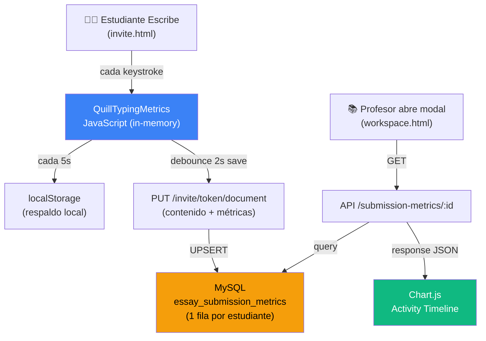

# Rediseño del Sistema de Métricas de Escritura en Tiempo Real

Optimización del almacenamiento, procesamiento y visualización de métricas de escritura en las pantallas **invite** (estudiante) y **workspace** (profesor).

---

## 1. Diagnóstico del Problema Actual

### 1.1 — Almacenamiento: No hay problema de "muchas filas por documento"

Tras analizar el código en profundidad, descubrí que **el modelo actual ya usa patrón UPSERT** (una sola fila por invitación):

```python
# metrics_routes.py L81 y workspace_routes.py L618
metric_record = EssaySubmissionMetrics.query.filter_by(
    invitation_id=invitation_id
).first()
# Si existe → actualiza, si no → crea nueva
```

✅ **Solo hay 1 fila por estudiante/invitación en `essay_submission_metrics`**. No se generan miles de filas.

> [!IMPORTANT]
> El modelo de almacenamiento actual es correcto en cuanto a cardinalidad. El problema **no es exceso de filas**, sino la estructura de datos interna y cómo se procesan para visualización.

### 1.2 — Problemas Identificados que SÍ Causan Fallos en Gráficos

#### BUG CRÍTICO 1: `activityByMinute` usa timestamps UNIX absolutos como claves

En [typing-metrics.js:L234](file:///Users/user/Documents/xplagiax_marktrack/static/js/typing-metrics.js#L234):
```javascript
const minuteKey = Math.floor((Date.now()) / 60000); 
// Genera claves como: 29543280, 29543281, 29543282...
```

Pero en [workspace.html:L1218-L1225](file:///Users/user/Documents/xplagiax_marktrack/templates/sections/workspace.html#L1218-L1225), el chart intenta renderizar así:
```javascript
const keys = Object.keys(activityMap).map(Number).sort((a,b) => a-b);
const maxMin = Math.max(...keys); // → 29543282 (enorme!)
for (let i = 0; i <= maxMin; i++) { // Intenta iterar ~30M veces → CONGELA EL BROWSER
    labels.push("Min " + i);
    dps.push(activityMap[i] || 0);
}
```

> [!CAUTION]
> **Este es el bug principal**: El loop de renderización intenta crear **hasta 30 millones de puntos** en el gráfico porque las claves son timestamps UNIX en minutos (no índices relativos 0,1,2...). Esto congela el navegador o genera un chart vacío/corrupto.

#### BUG 2: `raw_logs` JSON crece sin control efectivo

- `raw_logs` se almacena como JSON en MySQL con hasta 1000 eventos tipados
- Cada evento incluye `key`, `code`, `timestamp` — información redundante para log de auditoría
- El campo `raw_logs` puede llegar a pesar **50-200KB por estudiante**
- La columna `quill_delta` **también se duplica** en `essay_submission_metrics.quill_delta` Y en `marktrack_documents.content_delta`

#### BUG 3: Dos endpoints guardan métricas de forma redundante

- `/api/save-essay-metrics` (metrics_routes.py) — llamado por `typingMetrics.sendToServer()`
- `PUT /invite/<token>/document` (workspace_routes.py L611-647) — llamado por `saveDocument()`

Ambos hacen UPSERT de la misma fila, pero con lógica diferente. El segundo **sobrescribe `raw_logs` completos** en lugar de concatenarlos:
```python
# workspace_routes.py L637 - SOBRESCRIBE
metrics.raw_logs = metrics_payload.get('rawLogs', [])

# vs metrics_routes.py L108-112 - CONCATENA  
combined = existing + new_logs
metric_record.raw_logs = combined[-1000:]
```

#### BUG 4: `session_metadata.activity_by_minute` no se acumula entre sesiones

Cuando el estudiante recarga la página, `localStorage` restaura los contadores numéricos, pero `activityByMinute` mantiene claves absolutas que no se "reusan" — cada nueva sesión añade claves nuevas con gaps entre ellas.

---

## 2. Propuesta de Rediseño

### 2.1 — Tier de Almacenamiento por Dato

| Dato | Dónde | TTL | Justificación |
|------|-------|-----|---------------|
| Métricas acumuladas (WPM, keystrokes, tiempo, etc.) | **MySQL** `essay_submission_metrics` | Permanente | Datos ligeros (~200 bytes), 1 fila por estudiante |
| `activity_by_minute` (serie temporal) | **MySQL** columna JSON en `session_metadata` | Permanente | Ya está aquí; solo necesita fix de claves |
| `raw_logs` de auditoría (pausas, paste, focus) | **MySQL** JSON comprimido | Permanente | Solo eventos "interesantes" (no keydown/keyup) |
| Buffer de eventos real-time durante escritura | **Redis** hash | 5 min TTL | Evita writes constantes a MySQL |
| `quill_delta` en métricas | **Eliminar** | — | Ya existe en `marktrack_documents.content_delta` |
| Qdrant | **No usar** para métricas | — | No aplica; Qdrant es para búsqueda semántica, no series temporales |

### 2.2 — Arquitectura de Flujo Propuesta



> [!NOTE]
> **Decisión arquitectónica**: Eliminamos el endpoint `/api/save-essay-metrics` (metrics_routes.py) y consolidamos todo en `PUT /invite/<token>/document`. Esto evita la doble escritura y simplifica el flujo. Las métricas viajan junto con el documento en cada auto-save (ya implementado, solo necesita fix).

### 2.3 — Fix de `activityByMinute`: Claves Relativas

**Antes (buggy):**
```javascript
// Usa timestamp UNIX → claves 29543280, 29543281...
const minuteKey = Math.floor(Date.now() / 60000);
```

**Después (fix):**
```javascript
// Usa minutos relativos al inicio de la sesión → claves 0, 1, 2, 3...
const minuteKey = Math.floor((performance.now() - this.startTime) / 60000);
```

Y en la renderización del chart:
```javascript
// Antes: iteraba hasta maxKey (~30M) → CRASH
// Después: las claves ya son 0,1,2... → chart correcto
const keys = Object.keys(activityMap).map(Number).sort((a,b) => a-b);
if (keys.length > 0) {
    const maxMin = Math.max(...keys);
    for (let i = 0; i <= maxMin; i++) {
        labels.push("Min " + (i + 1));
        dps.push(activityMap[i] || 0);
    }
}
```

### 2.4 — Optimización de `raw_logs`: Solo Eventos Críticos

**Antes:** Se guardan keydown, keyup, pause, paste, visibility—todo.

**Después:** Solo guardar eventos "de auditoría" (los que el profesor realmente ve):

```javascript
logEvent(type, details = {}) {
    // FILTRO: Solo eventos significativos para auditoría
    const AUDIT_EVENTS = ['pause', 'paste', 'visibility-hidden', 'visibility-visible', 
                          'large-deletion', 'resume'];
    if (!AUDIT_EVENTS.includes(type)) return; // ← SKIP keydown/keyup
    
    if (this.rawLogs.length >= 200) { // Reducido de 1000 a 200
        this.rawLogs = this.rawLogs.slice(-150);
    }
    this.rawLogs.push({ t: type, ms: Math.round(performance.now() - this.startTime), ...details });
}
```

**Impacto**: Reduce `raw_logs` de ~50KB a ~5KB por estudiante (~90% reducción).

### 2.5 — Eliminación de Datos Duplicados

| Campo Duplicado | Ubicación actual | Acción |
|---|---|---|
| `quill_delta` | `essay_submission_metrics.quill_delta` + `marktrack_documents.content_delta` | **Eliminar de métricas**, usar JOIN al documento |
| `signature_data` | `essay_submission_metrics.signature_data` (Text 4GB max) | Mantener (es exclusivo de métricas) |
| Métricas en dos endpoints | `metrics_routes.py` + `workspace_routes.py` | **Consolidar en workspace_routes.py** |

### 2.6 — Uso Óptimo de Redis (Cache para el Profesor)

```python
# Al professor abrir el modal de métricas:
@metrics_bp.route('/api/submission-metrics/<int:submission_id>')
def get_submission_metrics_detail(submission_id):
    # 1. Intentar cache
    cache_key = f"metrics:detail:{submission_id}"
    cached = cache.get(cache_key)
    if cached:
        return jsonify(cached)
    
    # 2. Query MySQL
    metric = EssaySubmissionMetrics.query.get(submission_id)
    # ... construir respuesta ...
    
    # 3. Cachear por 2 minutos (el profesor puede abrir/cerrar modal)
    cache.set(cache_key, response_data, ttl=120)
    return jsonify(response_data)
```

---

## 3. Cambios Propuestos por Archivo

### Frontend (JavaScript)

---

#### [MODIFY] [typing-metrics.js](file:///Users/user/Documents/xplagiax_marktrack/static/js/typing-metrics.js)

1. **Fix `activityByMinute` keys**: Cambiar de `Date.now()` a tiempo relativo (`performance.now() - startTime`)
2. **Filtrar `rawLogs`**: Solo guardar eventos de auditoría, reducir max de 1000 a 200
3. **Acumular `activityByMinute` entre sesiones**: Al restaurar desde localStorage, mantener los datos previos
4. **Eliminar envío separado a `/api/save-essay-metrics`**: Las métricas viajan con el documento save

#### [MODIFY] [invite-editor-integration.js](file:///Users/user/Documents/xplagiax_marktrack/static/js/invite-editor-integration.js)

1. **Incluir métricas en el PUT del documento**: El body del `saveDocument()` ya viaja con delta/html, añadir `metrics` inline
2. **Eliminar el `sendToServer()` separado**: Ya no se necesita el POST independiente
3. **Invalidar cache Redis** al guardar (vía response header o flag)

---

### Backend (Python routes)

---

#### [MODIFY] [workspace_routes.py](file:///Users/user/Documents/xplagiax_marktrack/routes/workspace_routes.py)

1. **Fix `save_invite_document()` L611-647**: Concatenar `raw_logs` en lugar de sobrescribir. Limitar a 200 eventos.
2. **No guardar `quill_delta` en métricas**: Ya está en el documento principal
3. **Añadir invalidación de cache Redis** tras guardar métricas

#### [MODIFY] [metrics_routes.py](file:///Users/user/Documents/xplagiax_marktrack/routes/metrics_routes.py)

1. **Añadir cache Redis** al endpoint `GET /api/submission-metrics/<id>` (TTL 120s)
2. **Simplificar `save_essay_metrics()`**: Mantener pero marcar como deprecado; la ruta principal es `PUT /invite/<token>/document`
3. **Pre-procesar `activity_by_minute`** para formato chartable (normalizar claves a 0-based)

---

### Frontend (Chart visualization)

---

#### [MODIFY] [workspace.html](file:///Users/user/Documents/xplagiax_marktrack/templates/sections/workspace.html)

1. **Fix `_renderMetricsChartInternal()`**: Usar claves del map directamente en lugar de iterar 0→maxKey
2. **Mejorar el chart**: Añadir tooltips, mejor styling, manejo de datos vacíos
3. **Optimizar renderizado de logs**: Limitar a 50 eventos visibles con scroll virtual

---

### Modelo DB

---

#### [MODIFY] [models.py](file:///Users/user/Documents/xplagiax_marktrack/models/models.py)

1. **Eliminar columna `quill_delta`** de `EssaySubmissionMetrics` (datos duplicados)
2. **Añadir índice** a `invitation_id` para queries frecuentes
3. **Optimizar `to_dict()`**: No incluir `raw_logs` por defecto

---

## 4. Ejemplo: Antes vs Después

### Datos en `essay_submission_metrics` — ANTES

```json
{
  "raw_logs": [
    {"t":"keydown","ms":123,"key":"H","code":"KeyH","timestamp":"2026-04-04T..."},
    {"t":"keyup","ms":156,"key":"H","code":"KeyH","timestamp":"2026-04-04T..."},
    {"t":"keydown","ms":189,"key":"e","code":"KeyE","timestamp":"2026-04-04T..."},
    // ... 997 más eventos ...
  ],
  "session_metadata": {
    "activity_by_minute": {
      "29543280": 45,
      "29543281": 62,
      "29543282": 38
    }
  },
  "quill_delta": {"ops":[{"insert":"Hello world\n"}]},
  "signature_data": "data:image/png;base64,..."
}
```
**Tamaño: ~250KB por estudiante**

### Datos en `essay_submission_metrics` — DESPUÉS

```json
{
  "raw_logs": [
    {"t":"paste","ms":12400,"length":245},
    {"t":"pause","ms":45000,"type":"long","duration":8200},
    {"t":"visibility-hidden","ms":67000},
    {"t":"visibility-visible","ms":72000}
  ],
  "session_metadata": {
    "activity_by_minute": {
      "0": 45,
      "1": 62,
      "2": 38,
      "3": 71,
      "4": 23
    }
  },
  "quill_delta": null,
  "signature_data": "data:image/png;base64,..."
}
```
**Tamaño: ~8KB por estudiante (reducción ~97%)**

---

## 5. Query Optimizada para el Profesor

```sql
-- Antes: devuelve ~250KB por consulta con datos duplicados
SELECT * FROM essay_submission_metrics WHERE id = ?;

-- Después: solo lo necesario para el modal
SELECT 
    esm.id, esm.invitation_id, esm.total_time_seconds,
    esm.effective_time_seconds, esm.keystrokes, esm.backspaces, 
    esm.avg_hold_ms, esm.avg_interkey_ms, esm.long_pauses, esm.wpm,
    esm.session_metadata, esm.raw_logs, esm.signature_data,
    esm.submitted_at,
    wi.first_name, wi.last_name, wi.email
FROM essay_submission_metrics esm
JOIN workspace_invitations wi ON esm.invitation_id = wi.id
WHERE esm.id = ?;
```

---

## 6. Técnicas de Retención y TTL

| Estrategia | Implementación | Impacto |
|---|---|---|
| **raw_logs cap** | Max 200 eventos auditables | ~97% reducción storage |
| **quill_delta dedup** | Eliminar de métricas | ~40-50KB liberados por estudiante |
| **Redis TTL** | Cache del modal profesor: 120s | Reduce queries MySQL repetidas |
| **localStorage TTL** | Limpiar `tm_metrics_*` tras 72h sin usar | Evita acumulación en browser |
| **Cleanup job** (futuro) | Cron job: para workspaces cerrados hace +90 días, eliminar raw_logs | Libera espacio progresivamente |

---

## 7. Verificación

### Tests Automatizados
- Verificar que `activityByMinute` genera claves 0-based al enviar métricas
- Verificar que el chart renderiza correctamente con datos reales
- Verificar que `raw_logs` solo contiene eventos de auditoría

### Verificación Manual (Browser)
1. Abrir invite, escribir texto por 3+ minutos
2. Verificar en DevTools → Network que `PUT /invite/.../document` incluye `metrics` con claves 0-based
3. Abrir workspace modal como profesor → verificar que el chart muestra curva suave sin congelamiento
4. Verificar logs section muestra solo eventos significativos (no keydowns)

---

## Open Questions

> [!IMPORTANT]
> **¿Quieres que mantenga el endpoint `/api/save-essay-metrics` como respaldo**, o lo eliminamos completamente y consolidamos todo en el `PUT /invite/<token>/document`? El endpoint duplicado complica el código, pero eliminarlo requiere verificar que no haya otros consumers.

> [!IMPORTANT]
> **¿La columna `quill_delta` en `essay_submission_metrics` puede eliminarse inmediatamente**, o hay algún caso de uso donde el delta de métricas difiere del documento principal? Si hay versioning futuro, podríamos necesitarlo.

> [!NOTE]
> **Sobre Redis para buffering real-time**: El diseño actual (UPSERT directo a MySQL cada ~2s) funciona bien para volúmenes moderados (clases de 30-100 estudiantes). Un buffer Redis intermedio solo vale la pena si esperas 500+ escritores concurrentes. ¿Cuál es tu escala esperada?
