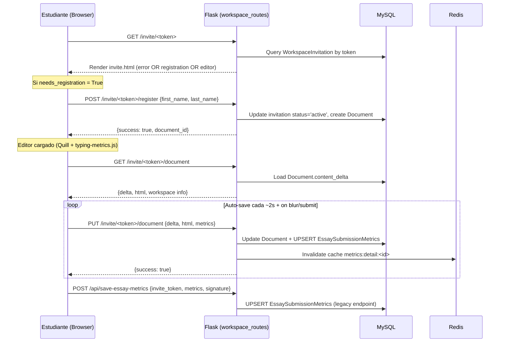
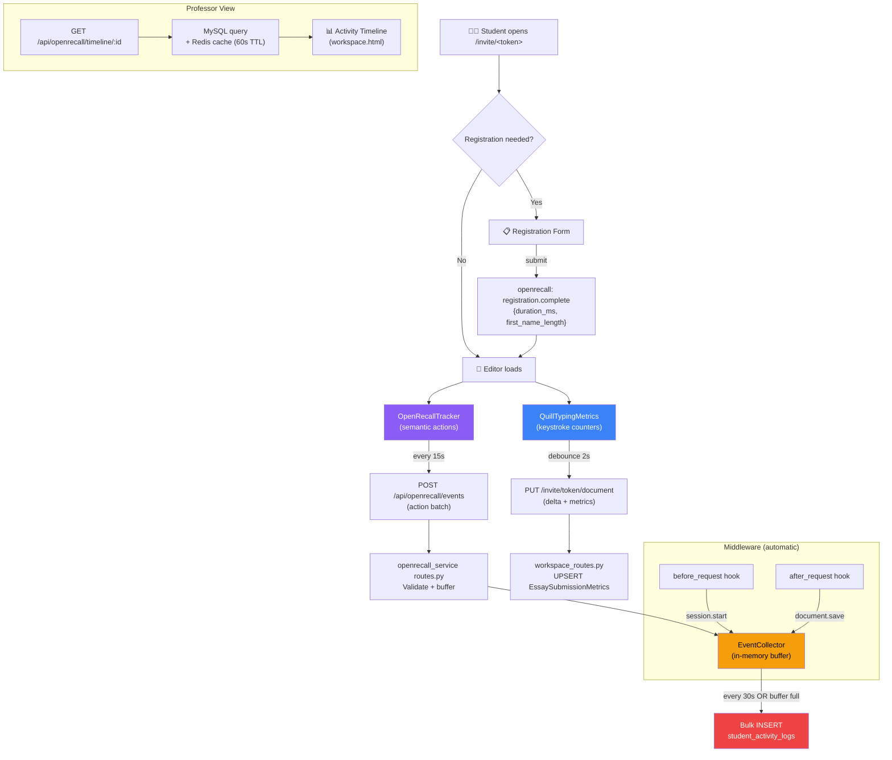

# OpenRecall Service — Módulo de Tracking Inteligente para Pantalla Invite

Diseño e implementación de `openrecall_service`: un módulo desacoplado que captura, filtra y persiste de forma inteligente las acciones relevantes del `usuario_estudiante` en la pantalla `invite`.

---

## Análisis de la Arquitectura Actual

### Estructura del Proyecto Xplagiax/MarkTrack

```
xplagiax_marktrack/
├── app.py                    # Flask app factory, blueprint registration
├── main.py                   # Legacy: BLOOMZ model + SocketIO (inactive)
├── models/models.py          # SQLAlchemy models (~1045 lines)
├── routes/                   # Flask Blueprints
│   ├── workspace_routes.py   # Invite flow (GET /invite/<token>, PUT document)
│   ├── metrics_routes.py     # Essay metrics API
│   ├── auth_routes.py        # Authentication
│   └── ...                   # 15+ route modules
├── services/                 # Business logic layer
│   ├── cache_service.py      # Redis CacheService singleton
│   ├── search_service.py     # Search engine
│   └── storage_sync.py       # SeaweedFS sync worker
├── settings/
│   ├── config.py             # DevelopmentConfig, ProductionConfig
│   └── extensions.py         # db, cache, limiter, redis, login_manager
├── static/js/
│   ├── typing-metrics.js     # QuillTypingMetrics class (keystroke/audit tracking)
│   ├── invite-editor.js      # Editor integration for invite page
│   └── ...                   # 30+ JS modules
├── templates/
│   ├── invite.html           # Student writing interface (840 lines)
│   └── sections/
│       └── workspace.html    # Professor dashboard
└── openrecall/               # OpenRecall library (standalone, NOT integrated)
    ├── app.py                # Standalone Flask app on port 8082
    ├── database.py           # SQLite with entries table
    ├── screenshot.py         # Screenshot capture thread
    ├── nlp.py                # SentenceTransformer embeddings
    ├── utils.py              # Platform-specific active window/app detection
    └── config.py             # Standalone config (--storage-path)
```

### Patrones Clave Identificados

| Patrón | Ubicación | Descripción |
|---|---|---|
| **Blueprints** | `app.py` L34-67 | Cada dominio funcional es un Blueprint registrado con prefijo |
| **Service Layer** | `services/` | Singletons (`CacheService`, `StorageSyncWorker`) con lógica de negocio |
| **UPSERT por invitación** | `workspace_routes.py` L618 | Una fila de métricas por estudiante, actualizada en cada save |
| **Token-based auth (students)** | `workspace_routes.py` L438-468 | Estudiantes NO usan `@login_required`; se autentican por token de invitación |
| **Redis cache** | `services/cache_service.py` | Cache con TTL, métricas de hit/miss, connection pool |
| **JSON columns** | `models.py` L847-848 | `raw_logs` y `session_metadata` como columnas JSON en MySQL |
| **localStorage persistence** | `typing-metrics.js` L70-108 | Métricas se guardan localmente cada 5s, restauran al recargar |

### Flujo Completo de la Pantalla Invite



### Eventos del Estudiante Actualmente Capturados

| Evento | Captura |  Almacenamiento | Problema |
|---|---|---|---|
| Keystrokes (count) | `typing-metrics.js` L236 | `keystrokes` (int) | ✅ Solo contador |
| Backspaces (count) | L249-250 | `backspaces` (int) | ✅ Solo contador |
| Pauses (long/medium) | L186-218 | `long_pauses` + `session_metadata` | ✅ Contadores + log |
| Paste events | L285-294 | `paste_count` + `raw_logs` | ✅ Con longitud |
| Large deletions | L143-153 | `large_deletions` + `raw_logs` | ✅ Con longitud |
| Visibility changes | L125-139 | `raw_logs` | ✅ Audit event |
| Activity per minute | L246-247 | `session_metadata.activity_by_minute` | ✅ Relative keys (fixed) |
| Registration | `workspace_routes.py` L471 | `invitation.status`, `accessed_at` | ❌ No granular |
| Page navigation | Not captured | — | ❌ Missing |
| Settings changes | Not captured | — | ❌ Missing |
| Sidebar interactions | Not captured | — | ❌ Missing |
| Time on registration | Not captured | — | ❌ Missing |
| Submission flow | Partially (signature only) | `signature_data` | ⚠️ Incomplete |
| Errors/failures | Not captured | — | ❌ Missing |
| Tab focus/blur timing | Partially (`visibility-hidden/visible`) | `raw_logs` | ⚠️ Needs enrichment |

---

## Diseño del Módulo `openrecall_service`

### Principios de Diseño

1. **Desacoplado**: El servicio es plug-and-play; puede removerse sin afectar el flujo principal
2. **Low Overhead**: Buffer en memoria → batch write → no bloquea el request cycle
3. **Inteligente**: Solo captura eventos **relevantes para integridad académica**, no todo
4. **Tolerante a fallos**: Failures silenciosos; jamás afecta la experiencia del estudiante
5. **Extensible**: Nuevos event types se añaden declarativamente

### Taxonomía de Eventos Inteligentes

> [!IMPORTANT]
> El módulo captura **acciones semánticas**, no inputs raw. La diferencia clave con `typing-metrics.js` es que `openrecall_service` trabaja a nivel **backend** y captura el **contexto completo** de cada acción.

#### Tier 1 — Eventos Críticos (siempre capturar)
| Evento | Trigger | Valor para integridad |
|---|---|---|
| `session.start` | GET /invite/\<token\> | Cuando accedió el estudiante |
| `session.end` | `beforeunload` → beacon API | Duración real de sesión |
| `registration.complete` | POST /register | Tiempo entre acceso y registro |
| `document.save` | PUT /document | Frecuencia y tamaño de saves |
| `document.submit` | POST /save-essay-metrics (final) | Momento de entrega formal |
| `paste.detected` | Frontend paste event → backend log | Contenido pegado (longitud + source hint) |
| `large_deletion` | Quill text-change > 10 chars | Eliminación sospechosa |

#### Tier 2 — Eventos Contextuales (capturar con sampling)
| Evento | Trigger | Valor para integridad |
|---|---|---|
| `focus.change` | visibilitychange API | Tiempo fuera de la pestaña |
| `idle.detected` | Inactivity > 30s | Patrones de inactividad |
| `editor.interaction` | Toolbar use, formatting | Evidencia de trabajo activo |
| `settings.change` | Theme/font changes | Personalización (evidencia de uso real) |

#### Tier 3 — Eventos de Ruido (NO capturar)
| Evento | Razón de exclusión |
|---|---|
| Individual keystrokes | Ya cubierto por `typing-metrics.js` contadores |
| Mouse movements | Alto volumen, bajo valor |
| Scroll position | Irrelevante para integridad |
| CSS hover events | Puro ruido |

### Estructura de Archivos

```
services/
└── openrecall_service/
    ├── __init__.py              # Package init, exports públicos
    ├── collector.py             # EventCollector: buffer en memoria + batch flush
    ├── models.py                # StudentActivityLog SQLAlchemy model
    ├── filters.py               # EventFilter: clasificación, dedup, sampling
    ├── routes.py                # Blueprint: API endpoints para recibir eventos del frontend
    ├── middleware.py             # Flask before/after request hooks
    └── config.py                # Configuración del módulo (umbrales, TTLs, feature flags)

static/js/
└── openrecall-tracker.js        # Lightweight frontend tracker (~3KB)
```

---

## Propuesta de Cambios

### Componente 1: Backend Service Layer

---

#### [NEW] [\_\_init\_\_.py](file:///Users/user/Documents/xplagiax_marktrack/services/openrecall_service/__init__.py)

Package initialization. Exports:
- `init_openrecall(app)` — registers blueprint + middleware
- `EventCollector` — singleton for direct use in routes

#### [NEW] [config.py](file:///Users/user/Documents/xplagiax_marktrack/services/openrecall_service/config.py)

Configuration class with sensible defaults:
```python
class OpenRecallConfig:
    ENABLED = True                          # Feature flag
    BUFFER_SIZE = 50                        # Events to buffer before flush
    FLUSH_INTERVAL_S = 30                   # Max seconds between flushes
    MAX_EVENTS_PER_SESSION = 500            # Hard cap per session
    SAMPLING_RATE_TIER2 = 0.5              # 50% sampling for Tier 2 events
    EVENT_DEDUP_WINDOW_MS = 1000           # Dedup identical events within 1s
    RETENTION_DAYS = 90                     # Auto-cleanup after 90 days
    ASYNC_WRITES = True                    # Use background thread for DB writes
```

#### [NEW] [models.py](file:///Users/user/Documents/xplagiax_marktrack/services/openrecall_service/models.py)

New SQLAlchemy model for activity logs:
```python
class StudentActivityLog(db.Model):
    __tablename__ = 'student_activity_logs'
    
    id = Column(BigInteger, primary_key=True, autoincrement=True)
    invitation_id = Column(Integer, ForeignKey('workspace_invitations.id', ondelete='CASCADE'), nullable=False)
    workspace_id = Column(Integer, ForeignKey('workspaces.id', ondelete='CASCADE'), nullable=False)
    
    # Event classification
    event_type = Column(String(50), nullable=False)      # 'session.start', 'paste.detected', etc.
    event_tier = Column(SmallInteger, default=1)           # 1=critical, 2=contextual
    
    # Event data (flexible JSON, capped at ~2KB per event)
    event_data = Column(JSON, nullable=True)
    
    # Context
    session_id = Column(String(36), nullable=False)       # UUID per browser session
    client_timestamp_ms = Column(BigInteger, nullable=True) # Client-side performance.now()
    server_timestamp = Column(DateTime, default=datetime.utcnow, nullable=False)
    
    # Denormalized for queries without JOIN
    student_email = Column(String(255), nullable=True)
    
    __table_args__ = (
        Index('idx_sal_invitation', 'invitation_id'),
        Index('idx_sal_workspace_type', 'workspace_id', 'event_type'),
        Index('idx_sal_session', 'session_id'),
        Index('idx_sal_timestamp', 'server_timestamp'),
    )
```

**Diseño de tabla deliberado**:
- `BigInteger` PK para alto volumen sin agotamiento de IDs
- `event_data` JSON flexible vs. columnas rígidas — extensibilidad sin ALTER TABLE
- Índices en `invitation_id` y `workspace_id+event_type` para queries frecuentes del profesor
- `session_id` UUID para agrupar eventos de una misma sesión del browser

#### [NEW] [collector.py](file:///Users/user/Documents/xplagiax_marktrack/services/openrecall_service/collector.py)

Core event collection engine with in-memory buffer and async flush:

```python
class EventCollector:
    """Thread-safe event buffer with periodic DB flush.
    
    Design:
    - Events arrive via collect() (called from routes or middleware)
    - Buffer is a thread-safe deque with maxlen = BUFFER_SIZE
    - A daemon thread flushes to MySQL every FLUSH_INTERVAL_S or when buffer is full
    - On Flask app teardown, remaining events are flushed synchronously
    
    Performance:
    - collect() is O(1) — never blocks the request
    - flush() uses bulk_insert_mappings for efficiency (~1ms per 50 events)
    - If DB is down, events are silently dropped (tolerance)
    """
```

Key methods:
- `collect(invitation_id, workspace_id, event_type, event_data, ...)` — O(1), thread-safe
- `_flush()` — bulk INSERT, runs in background thread
- `_should_sample(event_tier)` — probabilistic sampling for Tier 2
- `shutdown()` — graceful drain on app exit

#### [NEW] [filters.py](file:///Users/user/Documents/xplagiax_marktrack/services/openrecall_service/filters.py)

Event pre-processing pipeline:
- **Deduplication**: Identical `(invitation_id, event_type)` within `DEDUP_WINDOW_MS` → skip
- **Size limiter**: `event_data` JSON capped to 2KB; truncate if larger
- **Sanitizer**: Strip any PII from event payloads (email addresses in paste content, etc.)
- **Enrichment**: Add server-side data (IP hash, user-agent fingerprint)

#### [NEW] [routes.py](file:///Users/user/Documents/xplagiax_marktrack/services/openrecall_service/routes.py)

Flask Blueprint (`openrecall_bp`) with:

```python
# POST /api/openrecall/events — batch event ingestion from frontend
# Auth: by invite_token (same pattern as metrics_routes.py)
# Rate limited: 10 requests/minute per token
# Body: { invite_token, session_id, events: [{type, data, client_ms}] }

# GET /api/openrecall/timeline/<invitation_id> — professor view
# Auth: @login_required (professor must own workspace)
# Returns: paginated activity timeline with event classification
```

#### [NEW] [middleware.py](file:///Users/user/Documents/xplagiax_marktrack/services/openrecall_service/middleware.py)

Flask hooks for **automatic** server-side event capture:

```python
# before_request: Log 'session.start' on first /invite/<token> access
# after_request:  Log 'document.save' on successful PUT /invite/<token>/document
# No manual instrumentation needed in workspace_routes.py
```

---

### Componente 2: Frontend Tracker

---

#### [NEW] [openrecall-tracker.js](file:///Users/user/Documents/xplagiax_marktrack/static/js/openrecall-tracker.js)

Lightweight browser-side event collector (~3KB minified):

```javascript
class OpenRecallTracker {
    // Design: Complements typing-metrics.js WITHOUT duplicating its work
    // typing-metrics.js → keystroke counters, WPM, hold times (quantitative)
    // openrecall-tracker.js → semantic actions, context, navigation (qualitative)
    
    constructor(inviteToken) {
        this.token = inviteToken;
        this.sessionId = crypto.randomUUID();
        this.buffer = [];
        this.maxBuffer = 20;
        
        // Listeners for events NOT covered by typing-metrics.js
        this.attachListeners();
        
        // Flush every 15s via Beacon API
        this.flushInterval = setInterval(() => this.flush(), 15000);
        
        // Flush on page unload
        window.addEventListener('beforeunload', () => this.flush(true));
    }
    
    // Track: registration timing, settings changes, sidebar toggles,
    //        submission flow steps, error occurrences, focus patterns
    
    track(type, data = {}) {
        this.buffer.push({
            type,
            data,
            client_ms: Math.round(performance.now())
        });
        if (this.buffer.length >= this.maxBuffer) this.flush();
    }
    
    flush(useBeacon = false) {
        if (!this.buffer.length) return;
        const payload = {
            invite_token: this.token,
            session_id: this.sessionId,
            events: this.buffer.splice(0)
        };
        if (useBeacon) {
            navigator.sendBeacon('/api/openrecall/events', JSON.stringify(payload));
        } else {
            fetch('/api/openrecall/events', {
                method: 'POST',
                headers: { 'Content-Type': 'application/json' },
                body: JSON.stringify(payload),
                keepalive: true
            }).catch(() => {}); // Silent failure
        }
    }
}
```

**Key integration points in `invite.html`**:
- Initialize after `window.TOKEN` is set (line 726-727)
- Track registration form submit
- Track settings modal open/save
- Track sidebar/offcanvas toggles
- Track submit work flow steps

---

### Componente 3: Integration Points

---

#### [MODIFY] [app.py](file:///Users/user/Documents/xplagiax_marktrack/app.py)

Register the new blueprint and initialize the collector:
```python
from services.openrecall_service import init_openrecall
init_openrecall(app)
```

#### [MODIFY] [invite.html](file:///Users/user/Documents/xplagiax_marktrack/templates/invite.html)

Add the tracker script after `window.TOKEN` definition:
```html
<script src="{{ url_for('static', filename='js/openrecall-tracker.js') }}"></script>
<script>
    window.openRecallTracker = new OpenRecallTracker(window.TOKEN);
</script>
```

Add `data-track` attributes to key interactive elements for declarative tracking.

---

## Diagrama de Flujo de Eventos



---

## Estrategia de Persistencia

### Elección: MySQL (misma DB existente) + Redis buffer

| Alternativa | Evaluación | Decisión |
|---|---|---|
| **MySQL (relacional)** | Ya en uso, ORM existente, transaccional | ✅ **Elegida** |
| **SQLite separada** | OpenRecall original usa SQLite, pero no encaja con la arquitectura centralizada | ❌ |
| **Redis solo** | Volátil, no cumple requisito de persistencia a largo plazo | ❌ |
| **MongoDB/NoSQL** | Añade dependencia innecesaria al stack | ❌ |
| **Log files** | No queryable, difícil para el dashboard del profesor | ❌ |

### Estrategia de Escritura Eficiente

```
Frontend → Beacon/fetch → Route (validation) → EventCollector buffer (in-memory)
                                                    ↓ (every 30s OR 50 events)
                                              Bulk INSERT to MySQL
                                              (~1ms for 50 rows via bulk_insert_mappings)
```

**Impacto en latencia del request**: 
- `collect()` es O(1), ~0.01ms → **zero impact** en response time
- DB writes son async en daemon thread → **never blocks** the request cycle

### Retención y Limpieza

| Estrategia | Implementación |
|---|---|
| **Hard cap per session** | 500 events max por `session_id` |
| **Dedup window** | 1s dedup para eventos idénticos consecutivos |
| **Sampling Tier 2** | 50% probabilistic sampling para eventos contextuales |
| **Auto-cleanup** | Cron job / scheduled task: DELETE WHERE `server_timestamp` < NOW() - 90 days |
| **Lazy cleanup** | On workspace DELETE, cascade deletes activity logs |

---

## Seguridad y Privacidad

> [!WARNING]
> Los datos de actividad estudiantil son datos sensibles bajo FERPA/GDPR. El módulo implementa las siguientes medidas:

1. **Auth por token**: Mismo patrón que `metrics_routes.py` — sin token válido, el endpoint rechaza con 403
2. **No PII en `event_data`**: El sanitizer strip emails, nombres, contenido de clipboard > 50 chars
3. **IP hashing**: Se almacena `SHA256(IP + salt)`, no la IP raw
4. **Professor-only access**: El timeline API requiere `@login_required` + ownership check
5. **Rate limiting**: 10 req/min por token para prevenir abuse
6. **Data minimization**: Solo se capturan eventos clasificados en Tier 1/2; Tier 3 es descartado

---

## Testing

### Unit Tests

```
tests/
└── test_openrecall_service/
    ├── test_collector.py       # Buffer logic, flush, thread safety
    ├── test_filters.py         # Dedup, sampling, sanitization
    ├── test_routes.py          # Endpoint validation, auth, rate limit
    └── test_middleware.py      # Before/after request hooks
```

**Casos clave**:
- Buffer flush on full → bulk insert correctness
- Dedup window rejects identical events within 1s
- Sampling rate ≈ 50% over 1000 Tier 2 events
- Invalid token → 403
- Malformed payload → 400
- DB failure during flush → events dropped silently, no exception propagation
- Max events per session cap enforced

### Integration Tests

- Full invite flow with tracker: register → write → submit → verify activity log
- Professor timeline API: verify events appear in correct order with metadata
- Cascade delete: workspace deletion removes all related activity logs

### Load Simulation

- 100 concurrent students, 30-minute session each
- Expected: ~150 events/student → 15,000 total events
- Target: < 5ms p99 for `collect()`, < 500ms for bulk flush of 50 events

---

## User Review Required

> [!IMPORTANT]
> **Tabla nueva en MySQL**: La implementación requiere crear la tabla `student_activity_logs`. Esto se hará automáticamente via `db.create_all()` que ya se ejecuta en `app.py` L114-121. ¿Hay alguna política de migraciones (Alembic) que deba seguir en su lugar?

> [!IMPORTANT]
> **Relación con `typing-metrics.js`**: El nuevo `openrecall-tracker.js` es **complementario** — captura acciones semánticas que `typing-metrics.js` no cubre (registro, sidebar, settings, errores). No hay duplicación. ¿Estás de acuerdo con mantener ambos, o prefieres fusionarlos en un solo tracker?

> [!WARNING]
> **OpenRecall original (directorio `openrecall/`)**: Este directorio contiene una librería standalone (screenshots + OCR + embeddings) que **no está integrada** con la app Flask principal. Mi diseño de `openrecall_service` se **inspira** en sus patrones (captura periódica, almacenamiento local, procesamiento asíncrono) pero NO depende de él ni lo modifica. ¿Quieres que eventualmente integre funcionalidades del OpenRecall original (e.g., NLP embeddings para análisis semántico de la actividad)?

---

## Open Questions

1. **¿Escala esperada?** ¿Cuántos estudiantes concurrentes máximo? (el diseño actual soporta ~500 escritores concurrentes con flush cada 30s)

2. **¿Dashboard del profesor?** ¿Quieres que implemente también la visualización del timeline de actividad en `workspace.html`, o solo el backend + API por ahora?

3. **¿Feature flag?** El módulo incluye un `ENABLED = True/False` flag. ¿Quieres que arranque deshabilitado para pruebas?

---

## Verification Plan

### Automated Tests
- Unit tests para collector, filters, routes, middleware
- `python -m pytest tests/test_openrecall_service/ -v`

### Manual Verification
1. Abrir invite page → verificar que `session.start` aparece en `student_activity_logs`
2. Completar registro → verificar `registration.complete` con `duration_ms`
3. Escribir texto, cambiar settings, toggle sidebar → verificar eventos en DB
4. Verificar que `typing-metrics.js` sigue funcionando sin conflictos
5. Como profesor: llamar `/api/openrecall/timeline/<invitation_id>` → verificar respuesta
6. Eliminar workspace → verificar cascade delete de activity logs
